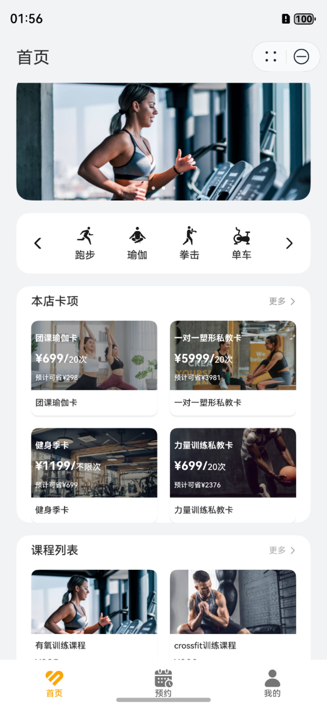
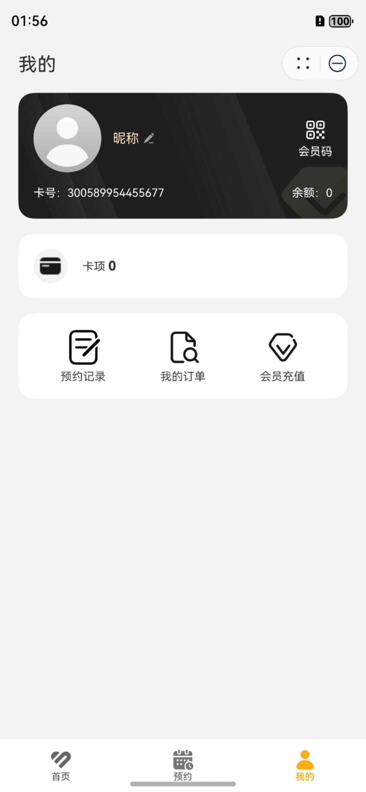

# 运动健康（健身房）元服务行业模板快速入门

## 目录

- [功能介绍](#功能介绍)
- [环境要求](#环境要求)
- [快速入门](#快速入门)
- [示例效果](#示例效果)
- [权限要求](#权限要求)
- [开源许可协议](#开源许可协议)


## 功能介绍

本模板为健身房会员平台的元服务提供了常用功能的开发样例，提供了健身房信息展示、课程展示、卡项展示、课程预定、卡项购买、会员中心等能力。模板主要分首页、预约、我的三大模块：

* 首页：展示健身房环境，包含运动项目、卡项、课程等。

* 预约：展示可预约的课程时间信息。

* 我的：提供账号管理、预约记录、订单记录、会员充值等功能。

本模板已集成华为账号、通话等服务，只需做少量配置和定制即可快速实现华为账号登录、一键拨号等功能。

| 首页                              | 预约                                 | 我的                              |
|---------------------------------|------------------------------------|---------------------------------|
|  |  |  |


本模板主要页面及核心功能如下所示：

```ts
健身房
 ├─ 首页
 │    ├─ 运动详情
 │    │    ├─ 运动对应卡项列表
 │    │    └─ 远动对应课程列表
 │    ├─ 本店卡项
 │    │    ├─ 卡项名称搜索
 │    │    └─ 本店卡项列表
 │    │         └─ 卡项详情
 │    │              ├─ 咨询
 │    │              └─ 提交订单
 │    ├─ 课程列表
 │    │    ├─ 课程名称搜索
 │    │    └─ 课程列表
 │    │         └─ 课程详情
 │    │              ├─ 咨询
 │    │              └─ 立即预约
 │    └─ 俱乐部环境
 │    
 ├─ 预约
 │    └─ 课程预约
 │         ├─ 课程搜索
 │         └─ 新增预约
 └─ 我的
      ├─ 会员卡
      │    ├─ 个人信息编辑-头像、昵称、手机号
      │    └─ 会员卡展示-卡号、会员码、余额
      ├─ 卡项
      │    └─ 会员已购卡项列表
      ├─ 预约记录
      │    ├─ 状态分类
      │    │    ├─ 全部
      │    │    ├─ 待使用
      │    │    ├─ 已完成
      │    │    ├─ 已过期
      │    │    └─ 已取消
      │    ├─ 预约记录列表
      │    └─ 预约记录详情
      ├─ 我的订单
      │    ├─ 状态分类
      │    │    ├─ 全部
      │    │    ├─ 已完成
      │    │    └─ 待支付
      │    ├─ 订单列表
      │    └─ 订单详情
      │    
      └─ 会员充值
```

本模板工程代码结构如下所示：

```ts
FitnessCenter  
├─common
│  ├─external_interactions
│  │  └─src
│  │      └─main
│  │         └─ets
│  │            ├─model
│  │            │      MockModel.ets                               // 公共数据模型，包含模板用到的所有数据类
│  │            │      
│  │            └─Service
│  │                    DateUtil.ets                               // 日期时间工具
│  │                    MockService.ets                            // 模拟数据服务类
│  │              
│  └─uiComponents
│      └─src
│          └─main
│             └─ets
│                └─components
│                    │  TitleBar.ets                               // 公共标题栏组件
│                    │  
│                    └─consulting
│                           Consulting.ets                         // 公共咨询组件
│                                 
├─features
│  ├─card
│  │  └─src
│  │      └─main
│  │         └─ets
│  │            ├─components
│  │            │      Card.ets                                    // 单卡项卡片组件
│  │            │      
│  │            ├─generated
│  │            │      RouterBuilder.ets                           // 路由构建类
│  │            │      
│  │            └─pages
│  │                    BuyCard.ets                                // 卡项购买页
│  │                    CardDetail.ets                             // 卡项详情页
│  │                    Order.ets                                  // 订单列表页
│  │                    OrderDetail.ets                            // 订单详情页
│  │                    ShowAllCards.ets                           // 本店卡项页
│  │                    UserCards.ets                              // 已购卡项列表页
│  ├─course      
│  │  └─src
│  │      └─main
│  │         └─ets
│  │            ├─components
│  │            │  ├─book
│  │            │  │      AddBooking.ets                            // 新增预约页
│  │            │  │      BookingDetail.ets                         // 预约详情页
│  │            │  │      BookingRecord.ets                         // 预约记录列表页
│  │            │  │      BookMain.ets                              // 课程预约入口页
│  │            │  │      ConfirmBooking.ets                        // 确认预约页
│  │            │  │      
│  │            │  └─course
│  │            │          Course.ets                               // 单课程卡片组件
│  │            │          CourseDetail.ets                         // 课程详情页
│  │            │          ShowAllCourse.ets                        // 本店所有课程列表页
│  │            │          
│  │            └─generated
│  │                    RouterBuilder.ets                           // 路由构建类         
│  └─vip
│      └─src
│          └─main
│             └─ets
│                ├─bean
│                │      VipRechargeItem.ets                         // 充值金额类
│                │      
│                ├─components
│                │      QrCodeDialog.ets                            // 会员码弹窗
│                │      UserInfoCard.ets                            // 用户会员卡片
│                │      
│                ├─data
│                │      BasicDataSource.ets                         // lazyForeach数据源基础类
│                │      VipRechargeDataSource.ets                   // 充值金额列表类
│                │      
│                ├─generated
│                │      RouterBuilder.ets                           // 路由构建类
│                │      
│                └─pages
│                       MineInfoPage.ets                            // 个人信息页
│                       RechargePage.ets                            // 会员充值页
│                      
└─products
   └─phone
       └─src
           └─main
              └─ets
           	     ├─entryability
          	     │      EntryAbility.ets                            // 应用主窗口
           	     │      
           	     ├─generated
           	     │      RouterBuilder.ets                           // 路由构建类
           	     │      
           	     ├─pages
          	     │      ClubEnvironmentDetail.ets                   // 俱乐部环境页
          	     │      FormCard.ets                                // 健身房服务卡片页
           	     │      Home.ets                                    // 首页
           	     │      Index.ets                                   // 主页面
           	     │      Mine.ets                                    // 我的
           	     │      SportDetail.ets                             // 运动详情页
           	     │
           	     └─phoneformability
           	            PhoneFormAbility.ets                        // 服务卡片窗口
```

## 环境要求

### 软件
* DevEco Studio版本：DevEco Studio 5.0.0 Release及以上
* HarmonyOS SDK版本：HarmonyOS 5.0.0 Release及以上
### 硬件
* 设备类型：华为手机（直板机）
* HarmonyOS版本：HarmonyOS 5.0.0 Release及以上


## 快速入门

在运行此模板前，需要完成以下配置：

1. 在DevEco Studio中打开此模板。

2. 在AppGallery Connect创建元服务，将包名配置到模板中。

   a. 参考[创建元服务](https://developer.huawei.com/consumer/cn/doc/app/agc-help-createharmonyapp-0000001945392297)为元服务创建APPID，并进行关联。

   b. 返回应用列表页面，查看元服务的包名。

   c. 将模板工程根目录下AppScope/app.json5文件中的bundleName替换为创建元服务的包名。

3. 配置华为账号服务。

   a. 将元服务的client ID配置到products/phone模块的module.json5文件，详细参考：[配置Client ID](https://developer.huawei.com/consumer/cn/doc/atomic-guides/account-atomic-client-id)。

   b. 添加公钥指纹，详细参考：[配置应用证书指纹](https://developer.huawei.com/consumer/cn/doc/app/agc-help-signature-info-0000001628566748#section5181019153511)。

   c. 如需获取用户真实手机号，需要申请phone权限，详细参考：[配置scope权限](https://developer.huawei.com/consumer/cn/doc/atomic-guides/account-guide-atomic-permissions)，并在端侧使用快速验证手机号码Button进行[验证获取手机号码](https://developer.huawei.com/consumer/cn/doc/atomic-guides/account-guide-atomic-get-phonenumber)。

###  运行调试工程
1. 连接调试手机和PC。

2. 对元服务签名：由于模板中集成了华为账号等服务，所以需要采用[手工签名](https://developer.huawei.com/consumer/cn/doc/harmonyos-guides/ide-signing)。

## 示例效果

[功能展示录屏](./screenshots/sample.mp4)


## 权限要求

* 网络权限：ohos.permission.INTERNET
* 读取日历信息权限：ohos.permission.READ_CALENDAR
* 更改日历信息权限：ohos.permission.WRITE_CALENDAR


## 开源许可协议

该代码经过[Apache 2.0 授权许可](http://www.apache.org/licenses/LICENSE-2.0)。

